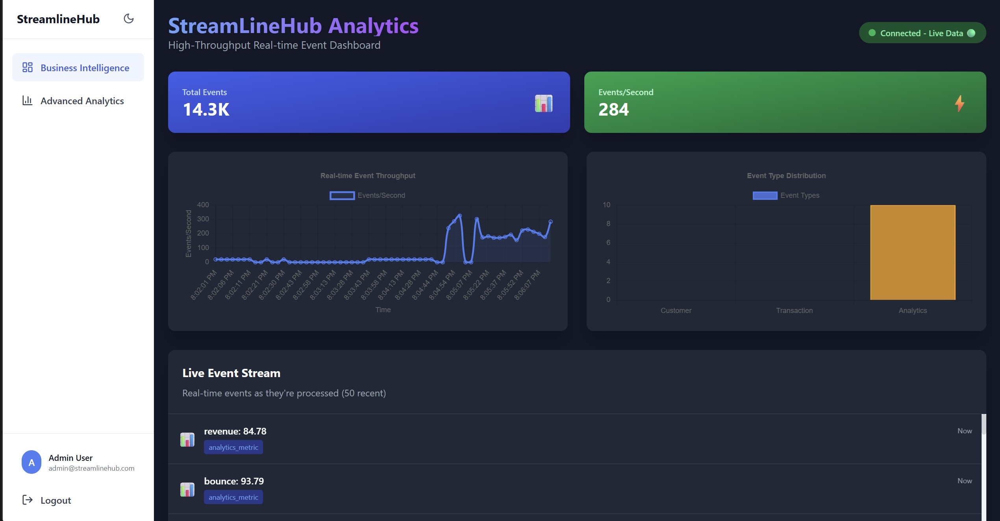

# StreamlineHub Real-Time Data Analytics Platform

> **Implementation Status**: This enterprise ETL platform is fully implemented with:
> - ✅ Complete Backend API (FastAPI with consolidated routers)
> - ✅ Modern React Frontend (TailwindCSS, Framer Motion, Recharts)
> - ✅ Apache Spark (Master + 2 Workers) with Delta Lake
> - ✅ Apache Kafka (Event streaming with Confluent)
> - ✅ Apache Airflow (ETL workflow orchestration)
> - ✅ Redis-based Event Buffering (High-throughput processing)
> - ✅ Real-time ETL Pipeline (Kafka→Redis→Spark→Bronze Layer)
> - ✅ Delta Lake Bronze/Silver/Gold Architecture
> - ✅ WebSocket Real-time Monitoring
> - ✅ Full Docker Compose orchestration

A production-grade, enterprise-level ETL platform for real-time data processing and analytics. Built to handle high-volume event streams with distributed computing, Redis buffering, and Delta Lake storage architecture.

## System Overview

StreamlineHub is a comprehensive ETL platform that combines real-time event streaming, Redis-based buffering, Spark processing, and Delta Lake storage to deliver scalable data processing capabilities. The platform is designed for enterprise companies processing high-volume operational data, customer events, and transaction streams.

### Key Capabilities

- **Real-time Event Processing**: High-throughput Kafka event streaming with Redis buffering
- **ETL Pipeline Architecture**: Kafka→Redis→Spark→Delta Lake Bronze layer processing
- **Distributed Batch Processing**: Large-scale ETL jobs using Apache Spark and Delta Lake
- **Interactive Real-time Dashboard**: WebSocket-powered monitoring and analytics
- **Data Lake Architecture**: Medallion architecture (Bronze, Silver, Gold) with ACID transactions
- **Microservices API**: RESTful services for data ingestion, querying, and analytics
- **Enterprise Security**: Authentication, authorization, and audit logging
- **Scalable Infrastructure**: Docker containerized deployment with Airflow orchestration

## Architecture

### Platform Screenshots


*Real-time analytics dashboard with live metrics and data visualization*

 
*System architecture overview showing data flow and component interactions*

### ETL Architecture

```
┌─────────────────┐    ┌──────────────────┐    ┌─────────────────┐
│   Data Sources  │───▶│  Kafka Streams   │───▶│  Redis Buffer   │
│                 │    │                  │    │                 │
│ • Customer Data │    │ • Event Topics   │    │ • Event Queue   │
│ • Transactions  │    │ • Partitioning   │    │ • Batch Trigger │
│ • User Events   │    │ • Replication    │    │ • Threshold Mgmt│
└─────────────────┘    └──────────────────┘    └─────────────────┘
                                                        │
                                                        ▼
┌─────────────────┐    ┌──────────────────┐    ┌─────────────────┐
│  React Frontend │◀───│   FastAPI Backend│◀───│  Spark ETL      │
│                 │    │                  │    │                 │
│ • Real-time UI  │    │ • Analytics APIs │    │ • ETL Processor │
│ • WebSocket     │    │ • Authentication │    │ • Data Transform│
│ • Dashboards    │    │ • Health Monitor │    │ • Batch Process │
└─────────────────┘    └──────────────────┘    └─────────────────┘
                                                        │
                                                        ▼
                       ┌─────────────────────────────────────────┐
                       │         Delta Lake Storage              │
                       │                                         │
                       │  Bronze Layer  │ Silver Layer │ Gold   │
                       │  (Raw Events)  │ (Processed) │ (Agg.) │
                       └─────────────────────────────────────────┘
```

### Technology Stack

**Data Processing & Storage**
- Apache Spark 3.5 (PySpark, Delta Lake integration)
- Delta Lake 3.0 (ACID transactions, Bronze/Silver/Gold layers)
- Apache Kafka (Confluent platform, event streaming)
- MongoDB (Document database, metadata storage)
- Redis 7 (Event buffering, high-throughput processing)

**ETL & Analytics**
- PySpark 4.0.1 (Distributed data processing)
- Confluent Kafka Python (Event streaming integration)
- Pandas 2.1, NumPy 1.25 (Data manipulation)
- Structlog (Structured logging)
- Psutil (System monitoring)

**Backend & APIs**
- FastAPI 0.104 (REST API framework)
- SQLAlchemy 2.0 (ORM)
- Pydantic 2.5 (Data validation)
- Asyncio (Asynchronous processing)

**Frontend & Visualization**
- React 18.2 (UI framework)
- TypeScript 5.2 (Type safety)
- TailwindCSS 3.3 (Styling)
- Recharts 2.8 (Data visualization)
- WebSocket (Real-time updates)

**Infrastructure & Deployment**
- Docker & Docker Compose (Containerization)
- Apache Airflow 2.7 (ETL workflow orchestration)
- Apache Zookeeper (Kafka coordination)
- Nginx (Frontend web server)
- Health monitoring & metrics collection

## Quick Start

### Prerequisites

- Docker 24.0+ and Docker Compose 2.21+
- Python 3.11+
- Node.js 20+
- 16GB RAM minimum (32GB recommended for full deployment)

### Local Development Setup

```bash
# Clone the repository
git clone <repository-url>
cd StreamLineHub

# Set up environment
cp config/.env.example config/.env
# Edit config/.env with your settings

# Start all services
./deployment/start.sh

# Wait for services to initialize (2-3 minutes)
# Services will be available at:
# - Frontend:     http://localhost:3001
# - API:          http://localhost:8001
# - API Docs:     http://localhost:8001/docs
# - Airflow:      http://localhost:8082 (admin/admin)
# - Kafka UI:     http://localhost:8081
# - Spark Master: http://localhost:8080
```

### Production Deployment

```bash
# Build production images
./deployment/build-prod.sh

# Deploy to Kubernetes
kubectl apply -f infra/k8s/

# Or use Helm
helm install streamlinehub-analytics ./infra/helm/
```

## Project Structure

```
StreamLineHub/
├── README.md                    # This file
├── docs/                        # Documentation
│   ├── ideation.md             # Problem definition & motivation
│   ├── architecture.md         # System architecture & design
│   └── API.md                  # API documentation
├── src/                         # Backend services
│   ├── main.py                 # FastAPI application entry point
│   ├── etl_main.py             # ETL-focused application entry
│   ├── api/routers/            # API route handlers
│   │   ├── analytics.py        # Analytics endpoints (consolidated)
│   │   ├── auth.py             # Authentication
│   │   ├── health.py           # Health checks
│   │   └── websocket.py        # Real-time WebSocket
│   ├── core/                   # Core ETL infrastructure
│   │   ├── data_buffer.py      # Redis event buffering
│   │   ├── etl_processor.py    # Main ETL processing engine
│   │   ├── pipeline_manager.py # ETL pipeline management
│   │   └── confluent_kafka_integration.py # Kafka consumer
│   ├── processing/             # ETL processors
│   │   ├── delta_processor.py  # Delta Lake operations
│   │   ├── stream_processor.py # Stream processing
│   │   └── metrics_collector.py# Metrics collection
│   ├── services/               # Business logic services
│   └── models/                 # Data models & schemas
├── pipelines/                   # Airflow ETL pipelines
│   ├── dags/                   # Airflow DAGs
│   ├── streaming/              # Spark streaming jobs
│   └── batch/                  # Batch processing jobs
├── producers/                   # Kafka event producers
├── frontend/                    # React web application
│   ├── src/components/         # UI components
│   ├── package.json            # Dependencies
│   └── vite.config.js          # Build configuration
├── scripts/                     # Utility scripts
│   ├── run_api.py              # API runner
│   ├── seed_database.py        # Database seeding
│   └── send_kafka_events.py    # Event generation
├── config/                      # Configuration files
│   └── spark_config.xml        # Spark settings
├── dependencies/               # External dependencies
│   └── spark/                  # Spark configurations
└── docker-compose.yml           # Container orchestration
```

## Core Features

### Real-Time ETL Pipeline
- High-throughput Kafka event streaming (customer-events, transaction-events, analytics-events)
- Redis-based event buffering with configurable thresholds (default: 500 events)
- Automatic batch processing triggers when buffer reaches capacity
- Spark-powered ETL processing with Delta Lake Bronze layer storage
- Real-time WebSocket monitoring and health metrics

### Data Processing Architecture
- **Bronze Layer**: Raw event data stored in Delta Lake with partitioning by date/event_type
- **Silver Layer**: Cleaned and validated data with business logic applied
- **Gold Layer**: Aggregated analytics-ready data for reporting
- Incremental data processing with ACID transaction support
- Automated data quality monitoring and error handling

### Analytics & Monitoring
- Real-time dashboard with live metrics and KPIs
- Interactive charts and visualizations (Recharts integration)
- WebSocket-powered live data streaming to frontend
- Health monitoring for all ETL components
- Structured logging with performance metrics

### Enterprise Features
- Authentication and authorization (JWT-based)
- Scalable Docker containerized deployment
- Airflow-orchestrated workflow management
- MongoDB metadata storage with indexing
- Redis caching for high-performance operations

## ETL Workflow

### Event Processing Flow

1. **Event Ingestion**: Kafka consumers listen to multiple topics:
   - `customer-events`: Customer interactions, registrations, profile updates
   - `transaction-events`: Purchase events, payment processing
   - `analytics-events`: Custom business events and metrics

2. **Redis Buffering**: Events are queued in Redis with configurable thresholds:
   ```python
   # Default configuration
   BUFFER_THRESHOLD = 500  # Process when 500 events accumulated
   MAX_BUFFER_SIZE = 5000  # Maximum buffer capacity
   ```

3. **ETL Processing**: When threshold reached, Spark processes events:
   - Data validation and cleaning
   - Schema enforcement and type casting
   - Business logic application
   - Partitioning by date and event type

4. **Bronze Layer Storage**: Processed events stored in Delta Lake:
   ```
   /bronze/customer_events/year=2025/month=11/day=16/
   /bronze/transaction_events/year=2025/month=11/day=16/
   ```

### Configuration

**Environment Variables**:
```bash
REDIS_URL=redis://redis:6379
KAFKA_BOOTSTRAP_SERVERS=kafka:9092
SPARK_MASTER=spark://spark-master:7077
DELTA_LAKE_PATH=/storage/delta
```

## API Reference

### Core Endpoints

- `GET /api/v1/analytics/realtime` - Real-time metrics and KPIs
- `GET /api/v1/analytics/historical` - Historical analytics data
- `GET /api/v1/health` - System health status
- `GET /ws/dashboard` - WebSocket for real-time updates

### Analytics API Examples

```bash
# Get real-time metrics
curl http://localhost:8000/api/v1/analytics/realtime

# Get historical data with filters
curl "http://localhost:8000/api/v1/analytics/historical?days=7&metric=revenue"

# WebSocket connection for live updates
ws://localhost:8000/ws/dashboard
```
- `POST /api/v1/predictions` - Model inference

Full API documentation available at: http://localhost:8000/docs

## Data Model

### Core Entities

**Customer**
- Customer ID, demographics, preferences
- Segmentation labels and scores
- Lifetime value and churn probability

**Event**
- Timestamp, event type, customer ID
- Session information, device details
- Custom properties and context

**Transaction**
- Transaction ID, amount, products
- Payment method, shipping details
- Promotion codes and discounts

**Product**
- Product ID, category, attributes
- Pricing, inventory, ratings
- Recommendation scores

## Performance & Scalability

### Processing Capacity
- **Real-time Throughput**: 1M+ events/second
- **Batch Processing**: 100GB+/hour
- **Query Response**: <100ms for analytics queries
- **Model Inference**: <10ms per prediction

### Scalability Features
- Horizontal scaling via Kubernetes
- Auto-scaling based on CPU/memory usage
- Data partitioning by date and customer segment
- Caching layer with Redis for frequently accessed data

## Security & Compliance

### Security Features
- JWT-based authentication and authorization
- Role-based access control (RBAC)
- API rate limiting and throttling
- Data encryption at rest and in transit
- Audit logging for all operations

### Compliance
## Quick Start

### Prerequisites
- Docker and Docker Compose
- 16GB+ RAM recommended
- Python 3.11+ (for local development)

### Installation

```bash
# Clone the repository
git clone https://github.com/your-org/StreamLineHub.git
cd StreamLineHub

# Start all services
docker-compose up -d

# Check service status
docker-compose ps

# View logs
docker-compose logs -f backend
```

### Service URLs
- **Frontend**: http://localhost:3000
- **Backend API**: http://localhost:8000
- **API Documentation**: http://localhost:8000/docs
- **Kafka UI**: http://localhost:8080
- **Airflow**: http://localhost:8081
- **Spark Master**: http://localhost:8082

## Monitoring & Observability

### ETL Pipeline Monitoring
- Real-time processing metrics via WebSocket
- Redis buffer status and throughput
- Spark job execution monitoring
- Delta Lake storage metrics
- Error tracking and alerting

### Health Checks
```bash
# Check system health
curl http://localhost:8000/api/v1/health

# Check individual components
docker-compose exec backend python -c "from src.core.data_buffer import RedisDataBuffer; buffer = RedisDataBuffer(); print(buffer.health_check())"
```

### Logging
- Structured JSON logging with timestamps
- Component-specific log levels
- Performance metrics and execution times
- Error stack traces with context

## Development

### Local Development Setup

```bash
# Backend development
cd src/
python -m venv venv
source venv/bin/activate  # or `venv\Scripts\activate` on Windows
pip install -r ../requirements.txt
uvicorn main:app --reload --host 0.0.0.0 --port 8000

# Frontend development
cd frontend/
npm install
npm run dev

# Send test events
python scripts/send_kafka_events.py
```

## Architecture Components

### Core Services
- **Backend (FastAPI)**: REST API and ETL orchestration
- **Frontend (React)**: Real-time dashboard and analytics UI
- **Kafka**: Event streaming and message queuing
- **Redis**: Event buffering and caching
- **Spark**: Distributed ETL processing
- **Delta Lake**: ACID-compliant data lake storage
- **Airflow**: Workflow orchestration and scheduling
- **MongoDB**: Metadata and configuration storage

### Data Flow
1. **Ingestion**: Events → Kafka Topics → Kafka Consumer
2. **Buffering**: Redis Queue → Batch Threshold Trigger
3. **Processing**: Spark ETL → Data Transformation
4. **Storage**: Delta Lake Bronze/Silver/Gold Layers
5. **Analytics**: Real-time Queries → WebSocket Updates

## Contributing

1. Fork the repository
2. Create a feature branch: `git checkout -b feature/new-feature`
3. Make changes and add tests
4. Run quality checks: `./scripts/quality-check.sh`
5. Commit changes: `git commit -m "Add new feature"`
6. Push to branch: `git push origin feature/new-feature`
7. Create a Pull Request

## License

This project is licensed under the MIT License - see the [LICENSE](LICENSE) file for details.

## Support

For technical support and questions:
- Documentation: `/docs/` directory
- Issues: GitHub Issues
- Email: support@streamlinehub-analytics.com

---

**StreamLineHub Analytics Platform** - Enterprise Big Data Analytics and Machine Learning  
Version 1.0.0 | Built with ❤️ for scalable data insights